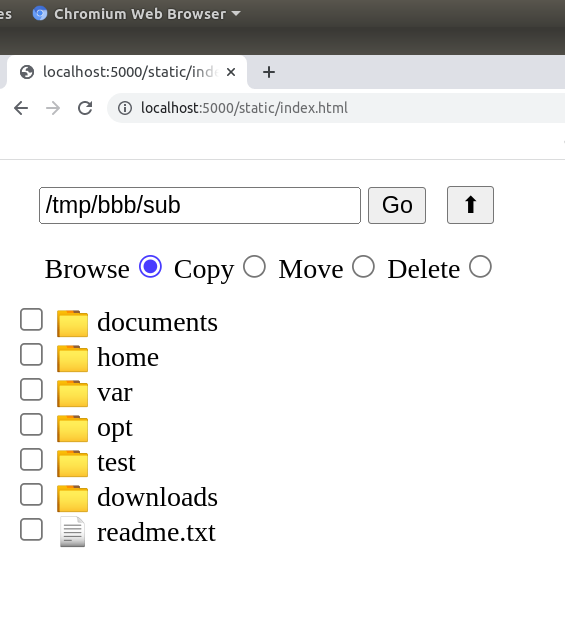

# webfilebrowser

- Allows browsing of files, folders through simple Web interface,
  works on Flask.

- Double click to view files, or see contents of a directory.

- For multiselect copy, move or delete, first check items from the
  left handside, and click on radio buttons of copy, or move. This
  puts you into target selection mode, browse to the directory you
  want to go to, and click 'done'. In case of delete, simply click
  done.

- App allows viewing of text files, png, jpg image files, pdf, and mp4
  video.

### TODO

- Dot files are filtered out, toggling that permission to view can be useful

- After multiselect, bult zip and download support

- "Favorites" folders to quickly jump between directories, the fav list
  can be read from a config file by flask, or stored on `localStorage`,
  specific to each user.

